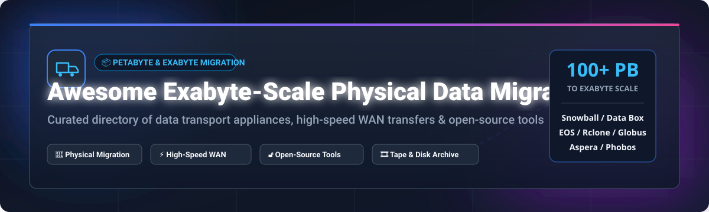

# Awesome-Exabyte-Scale-Physical-Data-Migration 📦 🚚 🌐

  

  
  
  
  
  

---

## 🌟 Top Exabyte-Scale Physical Data Migration & Storage Ecosystem 📦 🚀

**Curated List of Commercial Data Transport Appliances, Cloud Migration Platforms & Open-Source High-Speed Data Movement Tools**  

*Focused on Petabyte/Exabyte Physical Migration, AWS Snowball / Azure Data Box Appliances, High-Speed WAN File Transfer, Tape Archive Integration & Self-Hosted Data Movement*

**Last updated: October 2026** 📅

---

### 📌 Overview & SEO Summary 🔍 📊

Welcome to the ultimate curated directory of **exabyte-scale physical data migration platforms**, **open-source data movement tools**, and **petabyte-scale transfer frameworks**. Whether you are evaluating enterprise-grade commercial solutions (such as *Azure Data Box Heavy*, *Google Transfer Appliance*, and *Iron Mountain Secure Transport*), or self-hostable open-source alternatives (like *Syncthing*, *Rclone*, *restic*, *OpenZFS*, *EOS*, and *Globus*), this repository covers industry leaders, physical appliance shipping logistics, and high-performance data movement.

**Key Market & Technical Insights:** 💡

- **AWS Snowmobile Retirement:** Retired in March 2024 (and AWS Snowball Edge ordering paused for new accounts in late 2025), leaving **Azure Data Box Heavy (1 PiB usable capacity)** and **Google Transfer Appliance (up to 1 PB compressed)** as the dominant hyperscaler physical transport options.
- **Cost Efficiency Tpping Point:** Physical migration appliances become overwhelmingly cost-effective over network egress above **10 TB to 50 TB**, especially when transferring multi-petabyte datasets across high-latency WAN connections.
- **Enterprise Tape & Chain of Custody:** **Iron Mountain** and **Spectra Logic BlackPearl** deliver secure chain-of-custody, tape library integration, and physical security compliance for enterprise archives.

---

## 📑 Table of Contents 📜

- [🏢 SaaS & Commercial Platforms](#-saas--commercial-platforms)
- [🔓 Open-Source GitHub Projects](#-open-source-github-projects)
- [🛠️ How to Contribute](#%EF%B8%8F-how-to-contribute)
- [📊 Star History](#-star-history)
- [🤝 Support & Sponsorship](#-support--sponsorship)
- [⚠️ Disclaimer](#%EF%B8%8F-disclaimer)

---

## 🏢 SaaS / Commercial Platforms 🏬 📈

> 📊 **Market Size & Structure Analysis:**  
> The global data migration and physical data transport appliance market is estimated at **$12.5 Billion+** and is projected to expand significantly as enterprise cloud adoption reaches exabyte scales. The sector is **moderately fragmented** — while cloud hyperscalers (Microsoft Azure, Google Cloud, AWS) dominate offline physical hardware appliances via locked-in cloud entryways, specialized niches like high-speed WAN protocol acceleration (IBM Aspera, Resilio) and physical tape vaulting/chain-of-custody (Iron Mountain, Spectra Logic) maintain strong enterprise footholds rather than a single "winner-take-all" vendor.

The exabyte-scale physical data migration market spans **hyperscaler appliance services** (Azure Data Box Heavy, Google Transfer Appliance) providing **ruggedized physical devices for offline data transfer**, **enterprise data transport providers** (Iron Mountain) offering **secure chain-of-custody transport and tape archives**, and **high-speed file transfer platforms** (IBM Aspera, Resilio) accelerating **WAN-based data movement**.

| SaaS / Commercial Platform | Company / Owner | Company Size (Valuation / Market Cap) | Standard Edition Starting Price | Free Tier / Free Trial Limits | Description |
| :--- | :--- | :--- | :--- | :--- | :--- |
| **[Azure Data Box Heavy](https://azure.microsoft.com/en-us/products/databox/)** 🔷 | Microsoft | ~$3.90 Trillion Market Cap | **$100/device** + **$0.03/GB** data transfer | **No free tier**; 20-day evaluation period for standard Data Box | **Azure-native physical migration** — **Data Box Heavy: 1 PiB usable capacity** (about 20% less due to encryption and file system overhead). **SMB protocol support**. **Ruggedized, encrypted, and tamper-resistant**. |
| **[AWS Snowmobile](https://aws.amazon.com/snowmobile/)** ⚠️ | Amazon | ~$2.0 Trillion Market Cap | **Retired March 2024** ($300 base fee per job historically for Snowball Edge) | **Service discontinued**; no free trial | **Exabyte-scale physical migration (discontinued)** — **Retired in March 2024**. **AWS recommends Snowball Edge and Snowcone** for physical migration needs. |
| **[Google Cloud Transfer Appliance](https://cloud.google.com/transfer-appliance/)** 🌐 | Google (Alphabet) | ~$2.0 Trillion Market Cap | **$300 base fee** (100TB) or **$1,800** (480TB) + **$30–$90/day** rental | **10 days free (100TB) / 25 days free (480TB)** before daily rental charges apply | **GCP-native physical migration** — **Rackable appliance** for **offline data transfer**. **100 TB or 480 TB raw capacity** (up to **1 PB compressed**). **Per-day rental after free period**. |
| **[IBM Cloud Mass Data Migration](https://www.ibm.com/cloud/mass-data-migration)** 🔵 | IBM | ~$200 Billion Market Cap | **$50/day** per device rental | **No free tier**; sales demo available | **IBM-native physical migration** — **Supports up to 120 TB per appliance**. **Data encryption ensures sensitive information remains protected during transit**. **Established enterprise data migration appliance**. |
| **[IBM Aspera](https://www.ibm.com/products/aspera)** 🚀 | IBM | ~$200 Billion Market Cap | **₩16,500,000/year** (~$12,000/yr) per 100 Mbps install | **No free tier**; 30-day free trial available | **High-speed FASP protocol transfer** — **Patented transfer acceleration** for large files over WAN. **Up to 45x faster than TCP-based transfers** for 100 GB file with 140ms latency. **The gold standard for high-speed WAN transfer**. |
| **[Pure Storage FlashBlade](https://www.purestorage.com/)** 🟣 | Pure Storage | ~$15 Billion Market Cap | **$0.085–$0.118/GiB-month** (Evergreen//One subscription) | **No free tier**; interactive sandbox demo available | **Unified fast file and object storage** — **All-flash, NVMe architecture**. **Scales from 100TB to 10PB**. **>60 GB/s bandwidth**. **AI/ML-optimized**. |
| **[Iron Mountain Secure Data Transport](https://www.ironmountain.com/)** 🏔️ | Iron Mountain | ~$10 Billion Market Cap | **Custom quote** based on media volume & vaulting schedule | **No free tier**; consultation demo available | **Physical data transport and archiving** — **Secure chain-of-custody transport** for physical media. **Tape and disk migration services**. **1,400+ facilities globally**. **Trusted physical data transport provider**. |
| **[Scality RING](https://www.scality.com/)** 🏗️ | Scality | ~$100M–$250M Est. Valuation | **PAYG usage model** / Subscription quote per TB | **30-day free trial** for Scality ARTESCA (OVA virtual appliance) | **Software-defined object storage** — **S3-compatible**. **Scales to exabytes**. **Designed for cloud-native applications and data archiving**. |
| **[Spectra Logic BlackPearl](https://spectralogic.com/)** 🎞️ | Spectra Logic | ~$72M–$98M Est. Annual Revenue | **Custom enterprise hardware quote** per system | **No free tier**; expert consultation demo available | **On-premises digital archive** — **Ransomware-resilient** with virtual air gaps. **Scales to 6.4 exabytes** with TFinity Plus tape libraries. **NAS, S3, and tape interfaces**. |
| **[Resilio Connect](https://www.resilio.com/)** ⚡ | Resilio Inc. (Acquired by Nasuni) | ~$6M–$25M Est. Annual Revenue | **$7,500/year** starting annual subscription | **30-day free trial** (enterprise evaluation license) | **Peer-to-peer file synchronization** — **Uses BitTorrent protocol for accelerated multi-site transfer**. **No bandwidth caps**. **Supports hybrid cloud and edge deployments**. |

---

## 🔓 Open-Source GitHub Projects 🛠️ ⭐

*Sorted by GitHub_Stars_Count (Descending)* 🌟

- **[Syncthing](https://github.com/syncthing/syncthing)**   
  **Continuous peer-to-peer file synchronization**, MPL-2.0 licensed. **64K+ GitHub_Stars** — **decentralized, peer-to-peer data sync without central servers**. **TLS encryption, automatic file versioning, and conflict resolution**. **Ideal for continuous multi-site and edge server data mirror operations**. 📂 ⚡

- **[Rclone](https://github.com/rclone/rclone)**   
  **The Swiss army knife of cloud storage sync**, MIT licensed. **50K+ GitHub_Stars** — **supports 70+ cloud storage providers** with a unified CLI interface. **Sync, copy, move, mount (FUSE), and serve (HTTP/WebDAV/FTP)**. **Bandwidth limiting, checksum verification, and incremental transfers**. **The de facto standard for open-source cloud data migration**. 🔄 ☁️

- **[restic](https://github.com/restic/restic)**   
  **Fast, secure, efficient backup program**, BSD-2-Clause licensed. **28K+ GitHub_Stars** — **single self-contained binary with zero dependencies**. **Supports S3, GCS, Azure Blob, Backblaze B2, SFTP, and local storage**. **Built-in deduplication, AES-256 encryption, and incremental snapshots**. **The modern standard for encrypted data backups & migration snapshots**. ⚡ 🔒

- **[OpenZFS](https://github.com/openzfs/zfs)**   
  **Advanced enterprise file system and volume manager**, CDDL-1.0 licensed. **13K+ GitHub_Stars** — **unmatched data integrity, copy-on-write snapshots, and block-level replication**. **`zfs send` and `zfs receive` streams enable exabyte-scale incremental disk migrations across hosts**. 🗄️ 💾

- **[rsync](https://github.com/RsyncProject/rsync)**   
  **The classic incremental delta file transfer utility**, GPL-3.0 licensed. **7K+ GitHub_Stars** — **foundational delta-transfer algorithm** that transmits only modified file differences over SSH/network. **30 years of enterprise production reliability**. 📦 🚀

- **[BorgBackup](https://github.com/borgbackup/borg)**   
  **Deduplicating archiver with compression and authenticated encryption**, BSD-3-Clause licensed. **12K+ GitHub_Stars** — **authenticated encryption (AES-256), inline compression (LZ4, ZSTD), and client-side deduplication**. **Optimized for daily incremental server backups and archive transport**. 🛡️ 💾

- **[Kopia](https://github.com/kopia/kopia)**   
  **Cross-platform backup and restore tool**, Apache-2.0 licensed. **7.5K+ GitHub_Stars** — **fast, encrypted, deduplicated backups to cloud storage**. **Supports S3, Azure Blob, Google Cloud Storage, WebDAV, and SFTP with CLI and GUI interfaces**. 🚀 🔐

- **[EOS (CERN)](https://github.com/cern-eos/eos)**   
  **Highly scalable distributed storage system for large data volumes**, LGPL-3.0 licensed. **Developed at CERN for Large Hadron Collider (LHC) physics experiments**. **POSIX-like access, erasure coding, and multi-petabyte to exabyte scalability**. **Engineered for 1 TB/s aggregated egress speeds**. 🏛️ 🔬

- **[s3ql](https://github.com/s3ql/s3ql)**   
  **Full-featured FUSE file system for cloud object storage**, GPL-3.0 licensed. **1.3K+ GitHub_Stars** — **presents cloud object storage (S3, GCS, OpenStack) as an infinite-capacity hard drive**. **Supports compression, encryption, dynamic deduplication, and immutable snapshotting**. 💾 ☁️

- **[Chorus](https://github.com/clyso/chorus)**   
  **Distributed S3 object storage migration and proxy routing**, Apache-2.0 licensed. **Accelerates transfers between S3-compatible endpoints** using multi-node parallelization. **Real-time change data capture (CDC) and zero-downtime replication**. 🎯 🔀

- **[Phobos](https://github.com/phobos-storage/phobos)**   
  **Open-source tape & disk object storage system for HPC**, LGPL v2.1 licensed. **Developed by CEA** — **manages high-density tape libraries, disk arrays, and object stores**. **Archived 1 PB in 4 days with LTO-9 tape drives**. **Open formats with zero vendor lock-in**. 🎞️ 🗄️

- **[Globus](https://github.com/globus/globus-toolkit)**   
  **High-speed research data management & file transfer toolkit**, Apache-2.0 licensed. **Maintained by the University of Chicago**. **GridFTP parallel multi-stream file transfers with automatic recovery**. **Standard for petabyte-scale scientific dataset transfers across national labs**. 🔬 🌐

---

## 🛠️ How to Contribute 🤝 📝

Contributions are welcome! Follow these steps to submit new exabyte-scale data migration platforms or open-source data movement software:

1. 🍴 **Fork** the repository.
2. 📝 **Add/edit** entries in `README.md` maintaining table/list structure and formatting.
3. 🔗 Include project title, official website/GitHub link, exact Stars_Count badge, license, and brief description.
4. 🚀 Submit a **Pull Request** with a descriptive summary of your changes.

---

## 📊 Star History 📈

---

## 🤝 Support & Sponsorship ☕ 💖

Thank you for visiting and supporting the **Awesome Exabyte-Scale Physical Data Migration** project! If you find this curated ecosystem directory helpful for your storage engineering, enterprise cloud migration, or open-source infrastructure research, please consider supporting us:

- ⭐ **Star** this repository on GitHub to help increase its reach and discoverability!
- 🔀 **Fork & Share** with fellow storage architects, sysadmins, and data migration specialists.
- ☕ **Sponsor & Buy Me a Coffee**: Support ongoing open-source curation and research via the [GitHub Sponsor Dashboard](https://github.com/sponsors/ishandutta2007).

---

## ⚠️ Disclaimer ℹ️

- This is a **community-curated directory** — not exhaustive and not an endorsement of any commercial provider. ℹ️
- **AWS Snowmobile was retired in March 2024** — **AWS Snowball Edge is also restricted for new accounts**. **Azure Data Box Heavy (1 PiB)** and **Google Transfer Appliance (up to 1 PB compressed)** remain the primary hyperscaler physical migration hardware options.
- **Physical migration is cost-effective above 10 TB** — below that threshold, direct network transfer over dedicated fiber is usually faster and cheaper. Always model data volume, transport timeline, and bandwidth costs.
- **Open-source data migration tools (Rclone, restic, EOS, Phobos, Globus) require setup & testing** — always perform checksum verification (MD5/SHA256) after physical transport before decommissioning source datasets. 📦 🔒

---

  <b>Made with ❤️ for storage engineers, data migration specialists, and open-source data movement advocates.</b>

